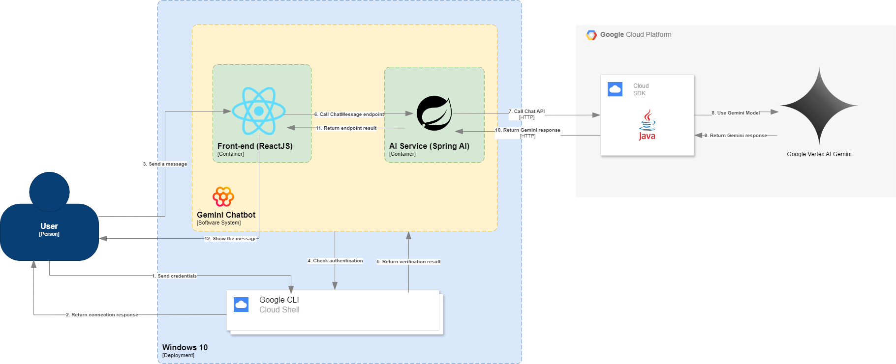

# Gemini Chatbot using Spring AI
This is a chatbot presented during my talk in Google I/O Extended Manila 2024.

## Session Title
Java in AI: Implementation of Google Vertex AI using Spring AI and Hilla

## System Landscape Diagram

### Sequence

<ol>
    <li>User send credentials via Google Cloud Shell</li>
    <li>Google Cloud Shell respond back if the authentication is successful</li>
    <li>User send a message</li>
    <li>Chatbot verifies if it can connect to user's Google Cloud project</li>
    <li>Return the verification result</li>
    <li>Call the Chat endpoint</li>
    <li>Call the Chat API of Google Cloud via HTTP</li>
    <li>Goggle Cloud Java Chat API uses Gemini Model</li>
    <li>Gemini Model responds back based on the user message</li>
    <li>Google Cloud Java SDK return the model response via HTTP</li>
    <li>Spring AI return the model response with modification (if any, based on business logic)</li>
    <li>The Chatbot shows the message</li>
</ol>

# Running locally

* Install Google Cloud CLI to authenticate locally: [Google Cloud CLI Authentication](https://cloud.google.com/docs/authentication/gcloud#local)
* Replace Google Project ID in [application.yml](src/main/resources/application.yml)
* Run <em>gradlew bootRun<em>

# License
License
MIT License

Copyright (c) 2024 Tristan Mahinay

Permission is hereby granted, free of charge, to any person obtaining a copy of this software and associated documentation files (the "Software"), to deal in the Software without restriction, including without limitation the rights to use, copy, modify, merge, publish, distribute, sublicense, and/or sell copies of the Software, and to permit persons to whom the Software is furnished to do so, subject to the following conditions:

The above copyright notice and this permission notice shall be included in all copies or substantial portions of the Software.

THE SOFTWARE IS PROVIDED "AS IS", WITHOUT WARRANTY OF ANY KIND, EXPRESS OR IMPLIED, INCLUDING BUT NOT LIMITED TO THE WARRANTIES OF MERCHANTABILITY, FITNESS FOR A PARTICULAR PURPOSE AND NONINFRINGEMENT. IN NO EVENT SHALL THE AUTHORS OR COPYRIGHT HOLDERS BE LIABLE FOR ANY CLAIM, DAMAGES OR OTHER LIABILITY, WHETHER IN AN ACTION OF CONTRACT, TORT OR OTHERWISE, ARISING FROM, OUT OF OR IN CONNECTION WITH THE SOFTWARE OR THE USE OR OTHER DEALINGS IN THE SOFTWARE.